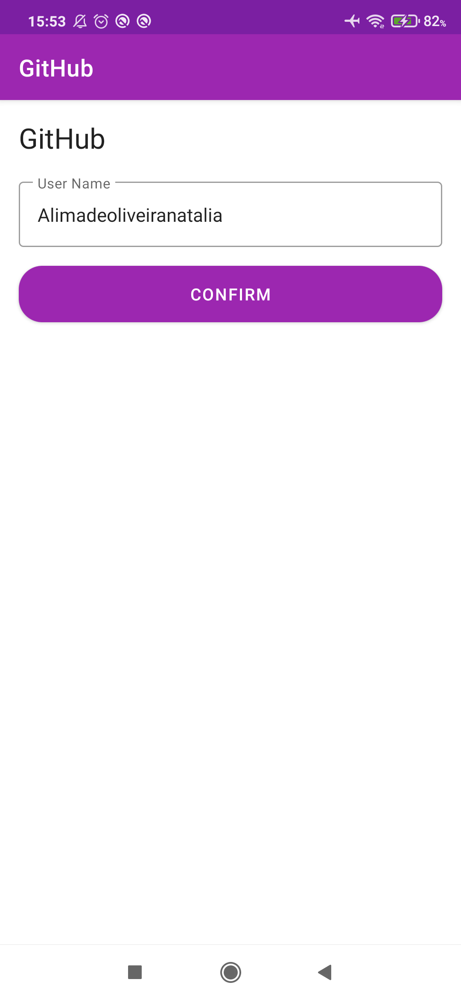
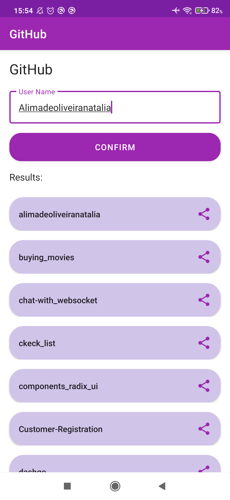

GitHub App
===================================

This project is my solution code for the "github-search" challenge, provided 
by [Digital Innovation One](https://www.dio.me) - An Information Technology teaching platform.

App Overview
-------------

The project searches a given GitHub user and lists all of his public repositories, and from that 
point, we can open or share any item. The App also ensures that the username can be saved, read and 
overwritten.

You can check out [the original repository](https://github.com/digitalinnovationone/desafio-github-search) for 
further reference.

Technologies used:
---------------

- ViewModel
- LiveData
- Fragment
- RecyclerView
- Shared Preferences
- GitHub API

Screenshots:
------------
 

Getting Started
---------------

1. Download and run the app.

License
-------

Licensed to the Apache Software Foundation (ASF) under one or more contributor
license agreements.  See the NOTICE file distributed with this work for
additional information regarding copyright ownership.  The ASF licenses this
file to you under the Apache License, Version 2.0 (the "License"); you may not
use this file except in compliance with the License.  You may obtain a copy of
the License at

http://www.apache.org/licenses/LICENSE-2.0

Unless required by applicable law or agreed to in writing, software
distributed under the License is distributed on an "AS IS" BASIS, WITHOUT
WARRANTIES OR CONDITIONS OF ANY KIND, either express or implied.  See the
License for the specific language governing permissions and limitations under
the License.
